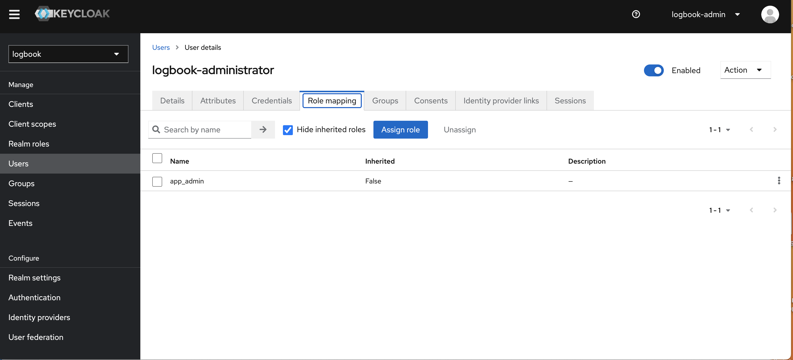
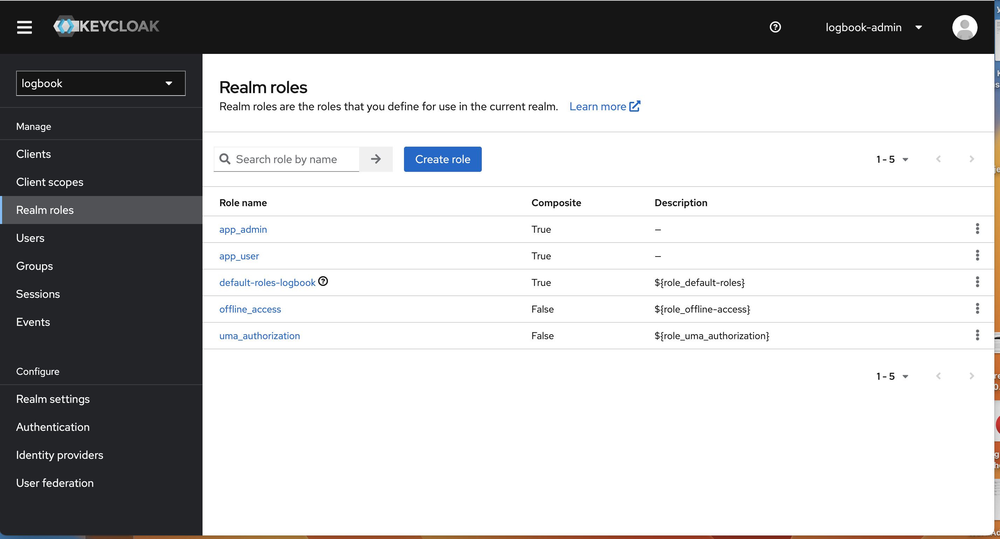
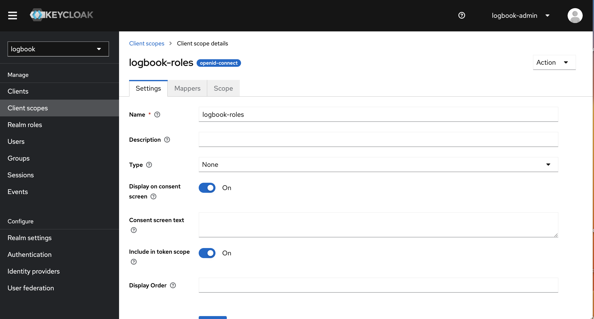
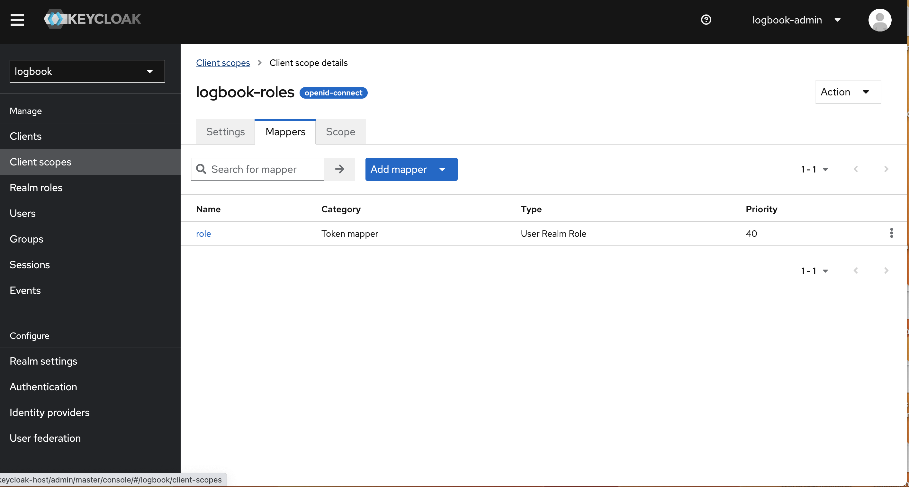
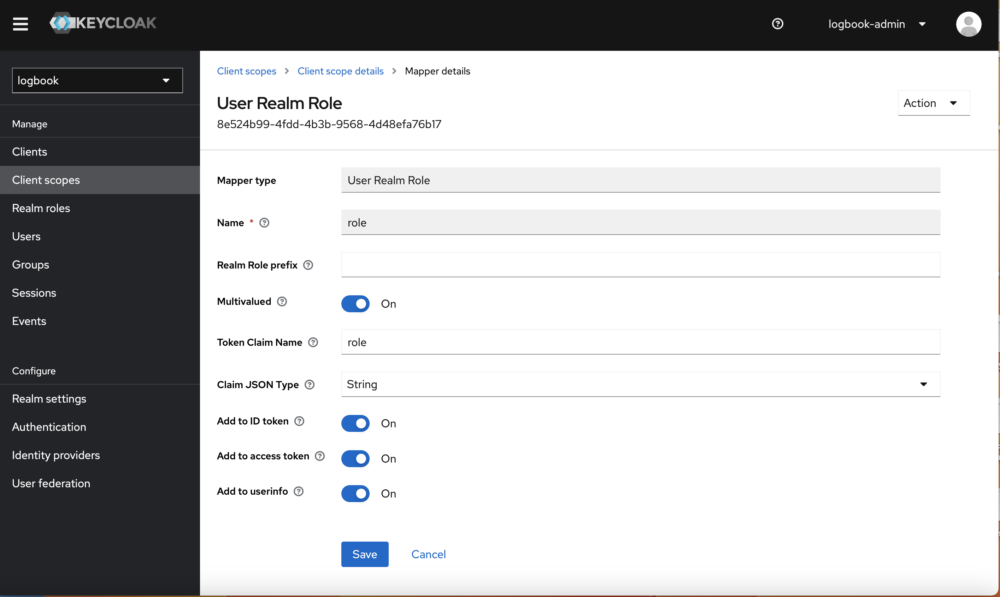
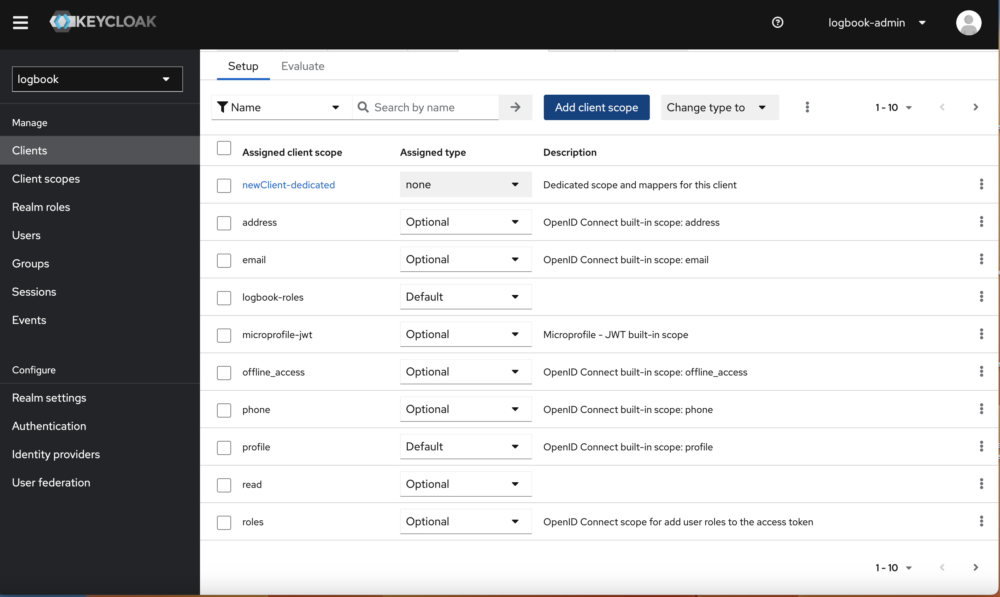
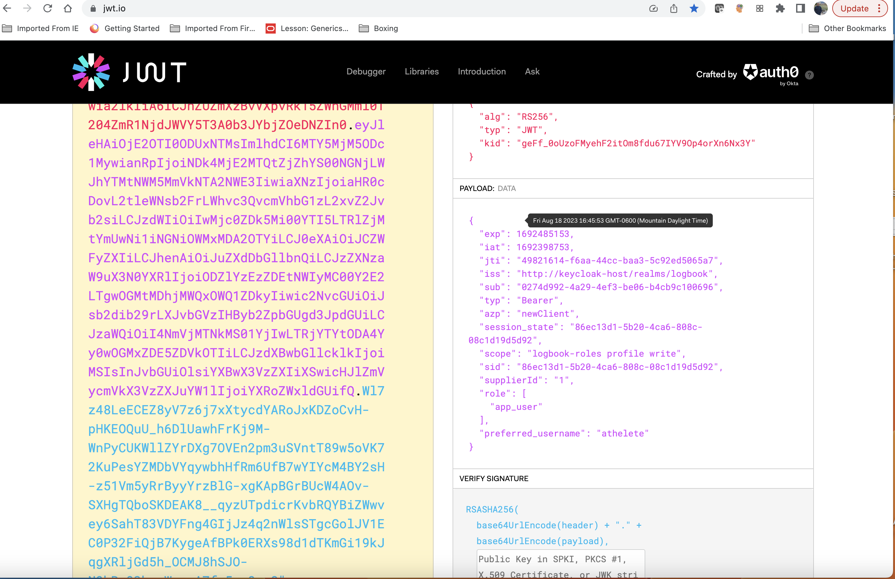

Project setup instructions

This project uses docker containers for test (test-containers), as well as kubernetes for execution so that we do not have to
install anything other than docker for mac or docker for windows. It also requires you to compile with java 17 and maven.
Once you have kubernetes installed, you will need to install helm. If you are running on a mac, "brew install helm" will do the
trick.

This project utilizes the approach of merging changes into existing domain objects pulled from database from dtos, 
versus creating new domain object graph to be persisted directly into the database, for example if you were using ModelMapper.
The thing I don't like about the direct persistence approach is that the client side has the ability to modify anything. If
we use what I am calling the "merge approach", the domain objects can control what aspects of changes that are possible.
The downside is that merging can be somewhat complex. Take a look at the interface, 
com.mjdsoftware.logbook.domain.entities.DomainObjectCollectionEntry and how it's used in code to merge collection changes.

This project is deployed as an Oauth2 "Resource Server". It utilizes keycloak as an Authentication/Authorization Server, and the two
servers interact at runtime.


After getting that prerequisite installed, do the following:

1. Build the project:

```
mvn clean install -P build-docker-image
```

2. Install postgres via a helm chart:
```
cd k8sconfig-local
helm repo add bitnami https://charts.bitnami.com/bitnami  
helm repo update
helm install postgresql  bitnami/postgresql --version 12.1.9 --values=logbook-postgresql-values.yaml
helm install postgresql-keycloak  bitnami/postgresql --version 12.1.9 --values=keycloak-postgresql-values.yaml
```

3. Install kubernetes artifacts: In the k8sconfig-local directory
```
./constructCluster.sh
```

4. In /etc/hosts, add the following entries:
```
127.0.0.1       logbook
127.0.0.1       keycloak-host
```

5. For keycloak, go to http://keycloak-host. Login is logbook-admin/pass. You will need to login and
create a realm called logbook. When creating the realm, import the src/set/resources/test-realm.json. This will create a set of
keycloak users for you.

   

   

   


6. Once all pods are running, go to url http://logbook/swagger-ui/index.html to get to swagger. To login you first need to get a
JWT. To do that, you can go to the OauthController (as a convenience) with user athelete/athelete to get a token.
Copy the token, then click the Authenticate button at the top of the Swagger page and enter the copied
token. Then you should be able to interact with the Logbook Controller via swagger.

   

   

   


7. Something to note. I have put the actuator on port 8081 in this project. Its not exposed through the ingress, so the
only way you can get to it is by doing a port-forward. For example on logbook, do 
```

   kubectl port-forward logbook-pod-goes-here 8081:8081
   Then go to a browser and enter http://localhost:8081/actuator
   and you should see thew basic actuator response.
   Entering http://localhost:8081/actuator/health in a browser should also work.
   The actuator/health uri is used in the logbook deployment yaml for liveness and readiness probes.
   
   
```

8. Added role based authentication to the OauthAccessController. Now you need to be in a realm role (from keycloak) of ROLE_app_admin to access keycloak users, as well as 
create and delete them. This will be used again later when I add multi-tenancy.

9. To connect to the logbook database:
```
kubectl port-forward postgresql-0 5432:5432
Create a connection to localhost:5432 using pgadmin or your favorite db tool. 
You should now be able to connect to the database running inside of Kubernetes.
```

10. I've added multi-tenancy to the app. Therefore, you now need to create users. User creation can be done
via the UserController REST service. 

    
    a. You need to create one administrative user in keycloak before doing anything else. This user needs to have the role of app_admin.



    b. Once this user has been created, you can use this user to log into the app, via the OauthAccessController with this new admin level user.
       See the Swagger interface above.

    c. Once connected as the admin user, you can now create users via the new implementation of UserController. From here its possible to
       create a new user. A representation of this user is created in Keycloak and in the application's database as well. At this point,
       you have the ability to create logbooks for the specific user, as well as other resources. Note that the admin user can do any of this
       activity on behalf of another user. This has been implemented as part of the MethodSecurityService currently.


    
    d. Note that you will want to make sure you create "realm roles" for app_admin, but also a typical app user that does not 
       have admin privileges in the application (app_user in my case). In the logbook application, a non app_admin will only have the ability to
       modify their own logbook.



    e. In order for the roles to be included in the Jason Web Token (JWT) returned by keycloak when a user autheticates,
       you will need to create something called a "client scope". You can name it anything you want, but here I call it
       logbook-roles.



    f. The important aspect of a Client Scope is that it has a mapper. The mapper is going to take the user's role
       and include it in a variabble as an array in the JWT. In this case, I called it "role". You can call it anything you
       want, but it needs to match the jwt:auth:converter:resourceId: property in applicagtion.yml and in
       k8sconfig-local/logbook/logbook-config-map.yml.



    g. The role mapper for this client scope needs to be created according to the above image.




    h. Next the ClientScope needs to be added to the client called NewClient, as in the image above. Remember, I called
       it logbook-roles. Once this is done, the "role" property will be included in the JWT as an array (see below). If you look at
       the class com.mjdsoftware.logbook.security.JwtAuthConverter, that is the class that extracts
       the role from the JWT and includes it in the incoming user's granted authorities so that we
       can use the role for method level security in Springboot.



11. A first implemetation of an export facility has been completed. It will currently be host mapped to /tmp on your local machine (you need to prefix the 
filename with /data/ in code when you upload it via the Swagger interface), so if you want to change this directory, you need to change 
projectDir/k8sconfig-local/logbook/logbook-tempspace-pv.yml to point at a different directory. 
The idea behind it is that you can take the csv file and use a graphing facility to 
analyze trends from workout to workout. See http://logbook/swagger-ui/index.html#/LogbookController/exportActivities
for the interface details.


12. Project next steps:

    -Bug(s)

             - create logbookentry without any creation of activities since we now subclass.

             - dates not passing through on activity date...issue

    -Statistics

    -A lot more test cases (light on tests right now)

    -Helm chart(s) for everything

    -Experiment with MapStruct

    -Change Oauth2 password grant type to at least authorization code grant type


Reasons for doing this project (besides learning)

I will have about 3 years of detailed rowing data after I get the code for this project completed. One of my
goals with my data and this software is to determine the effects of Zone 2 cardio training on one's body. Based on
the research we would think that, after a couple of years of zone 2 training, we should see heart rate stay stable and
output (calories/average watts/distance/etc) improve over time. So, I would like to test this assumption using my
own body.


