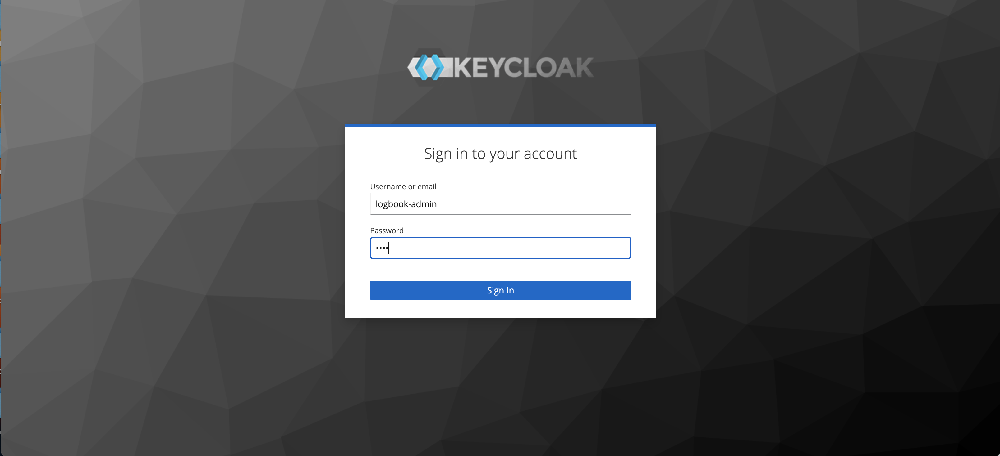
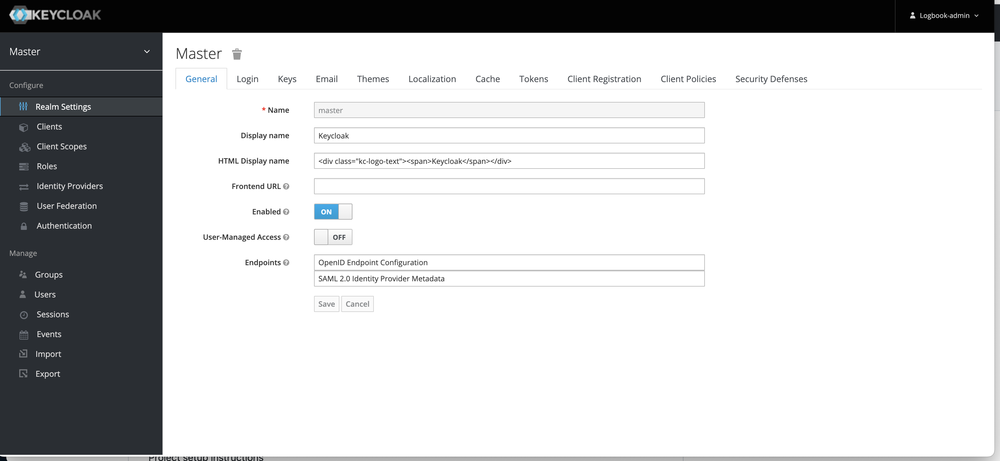
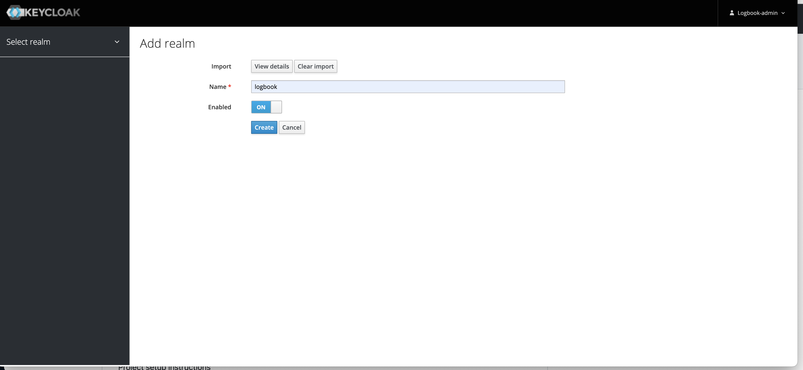
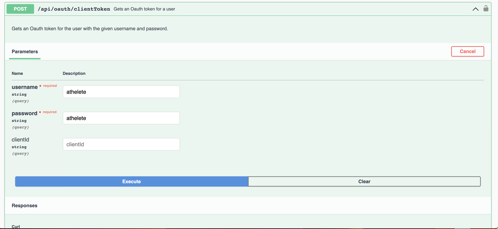
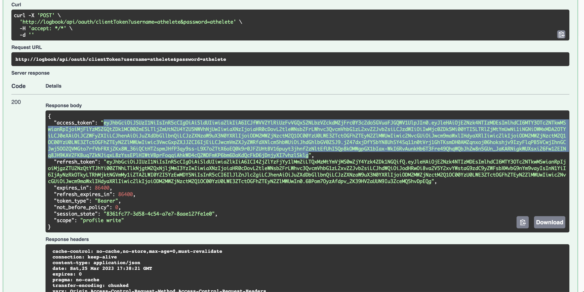
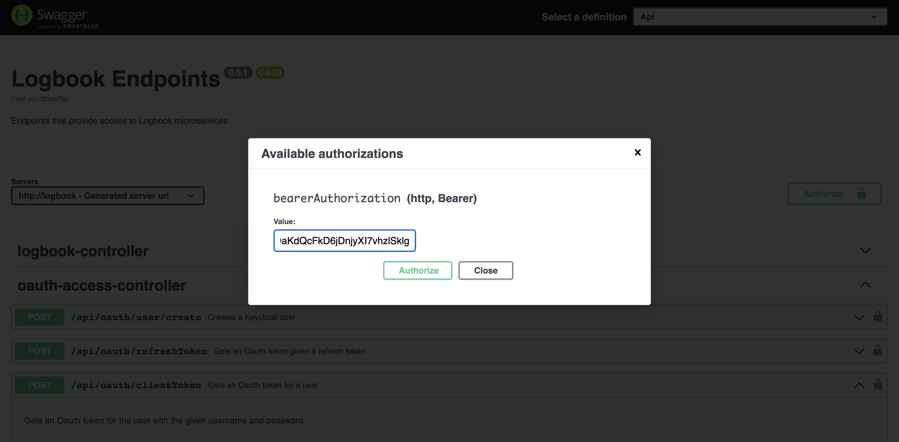

Project setup instructions

This project uses docker containers for test (test-containers), as well as kubernetes for execution so that we do not have to
install anything other than docker for mac or docker for windows. It also requires you to compile with java 17 and maven.
Once you have kubernetes installed, you will need to install helm. If you are running on a mac, "brew install helm" will do the
trick.

This project utilizes the approach of merging changes into existing domain objects pulled from database from dtos, 
versus creating new domain object graph to be persisted directly into the database, for example if you were using ModelMapper.
The thing I don't like about the direct persistence approach is that the client side has the ability to modify anything. If
we use what I am calling the "merge approach", the domain objects can control what aspects of changes that are possible.
The downside is that merging can be somewhat complex. Take a look at the interface, 
com.mjdsoftware.logbook.domain.entities.DomainObjectCollectionEntry and how it's used in code to merge collection changes.

This project is deployed as an Oauth2 "Resource Server". It utilizes keycloak as an Authentication/Authorization Server, and the two
servers interact at runtime.


After getting that prerequisite installed, do the following:

1. Build the project:

```
mvn clean install -P build-docker-image
```

2. Install postgres via a helm chart:
```
cd k8sconfig-local
helm repo add bitnami https://charts.bitnami.com/bitnami  
helm repo update
helm install postgresql  bitnami/postgresql --version 12.1.9 --values=logbook-postgresql-values.yaml
helm install postgresql-keycloak  bitnami/postgresql --version 12.1.9 --values=keycloak-postgresql-values.yaml
```

3. Install kubernetes artifacts: In the k8sconfig-local directory
```
./constructCluster.sh
```

4. In /etc/hosts, add the following entries:
```
127.0.0.1       logbook
127.0.0.1       keycloak-host
```

5. For keycloak, go to http://keycloak-host. Login is logbook-admin/pass. You will need to login and
create a realm called logbook. When creating the realm, import the src/set/resources/test-realm.json. This will create a set of
keycloak users for you.

   

   

   


6. Once all pods are running, go to url http://logbook/swagger-ui/index.html to get to swagger. To login you first need to get a
JWT. To do that, you can go to the OauthController (as a convenience) with user athelete/athelete to get a token.
Copy the token, then click the Authenticate button at the top of the Swagger page and enter the copied
token. Then you should be able to interact with the Logbook Controller via swagger.

   

   

   


7. Project next steps:

    -I want to add "dto projections" so I don't have to translate from domain objects to dtos.

    -Role-based security

    -Multi-tenancy -> Add user object
    
    -Experiment with MapStruct

